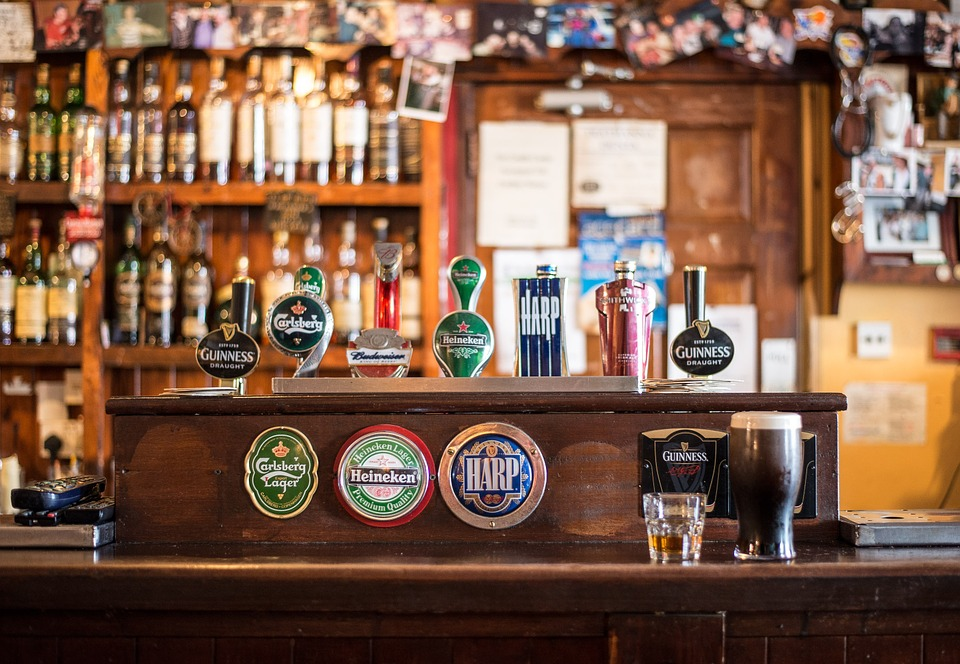
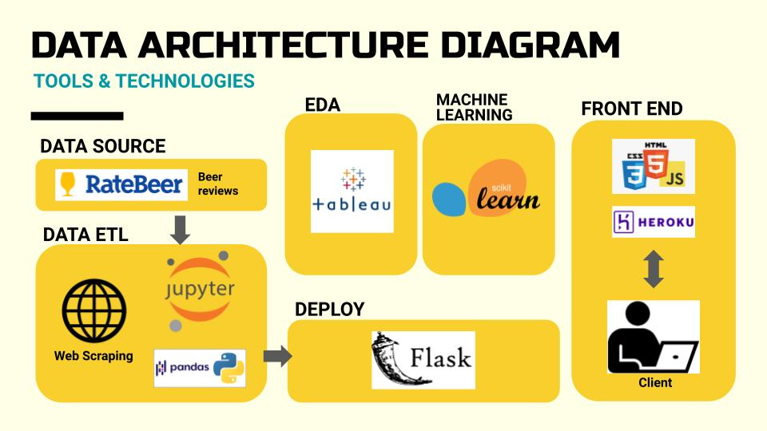

# Beer Recommendation App

**Submitted By:** Dong Yi Kim | Saif Gorges | Saloni Gupta | Sooyeon Kim  
_Date_: March, 25th, 2021\
EDA & Machine Learning Project - **Beer Recommendation Web Application**  

Find the completed Toronto New Restaurant Analysis dashboard here: [Beer Recommendation App](https://beer-recommendation-app.herokuapp.com/)

## Table of Contents
  * [Overview](#overview)
  * [Data Sources](#data-sources)
  * [Exploratory Data Analysis](#eda)
  * [Machine Learning](#machine-learning)
    * [Item-Based CF](#item-based)
    * [User-Based CF](#user-based)
  * [Technologies](#technologies)

## Overview
Do you like beer? Do your friends like beer? Do you like making your friends feel bad about their choice of beer? Well look no further, we have the solution for you!
Our state-of-the-art beer recommendation app will tell you and your friends which beers to drink, so you can stop arguing about beer and just enjoy the night!
Using Machine Learning technology, our system will source hundred beers and recommend you the best beer for your taste based on aroma, appearance, flavour and texture. 
Now you don’t have to ask anybody for their "human" recommendations!

Our goal was to celebrate the end of graduation with a nice cold one. What better way to choose a beer than to get a machine learning alogorithm to do it for us?
Our recommender system, aims to deliver personalized recommendations to beer lovers across the country. Our final product consists of web scraped data, item-based collaborative filtering models using nearest neighbor collaborative filtering and latent factor collaborative filtering, all packed into an interactive Flask web-application. 
Our purpose is twofold: to create a recommender system of something fun for others to use and in the process learn how to build a complex recommender system.
  
  
  ## Data Sources
  
 Datasets Sources:   
  * Rate Beer Website User Reviews 
  
  ##  Architectural Diagram
  
  
  ## 🔭 ETL Process
  ### Extract
  
  ### Transform
  Data cleaned and transformed by using Python Jupyter Notebook - [Transform.ipynb](./All-About-Beer/data/Transform.ipynb).
  ### Load

  ## Machine Learning

  
  ## Fianl Proposal

  
 ## Over All layout

 ## Deployment
 This app is deployed public on Heroku App, click the following link to see how it looks like [Beer Recommendation App](https://beer-recommendation-app.herokuapp.com/)
 
 
## <a name="technologies">Technologies</a>
This project was created with:
* JavaScript
* HTML/CSS
* D3
* Flask
* Python 3.8
* Pandas
* Jupyter Notebook

